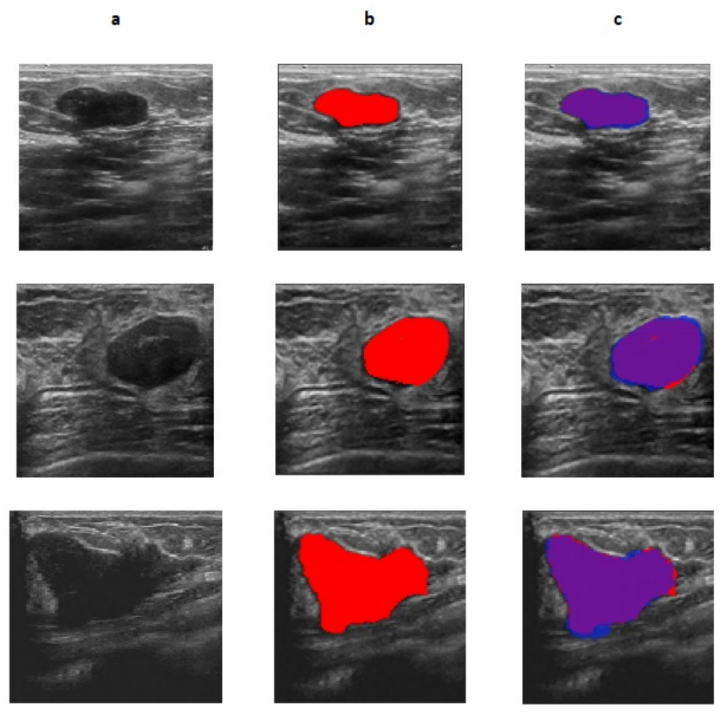

## RDA-UNET-WGAN: An Accurate Breast Ultrasound Lesion Segmentation Using Wasserstein Generative Adversarial Networks

### [Paper](https://doi.org/10.1007/s13369-020-04480-z)



This repo contains training, evaluation, and visualization code for the RDA-UNET-WGAN model from our from our RDA-UNET-WGAN: An Accurate Breast Ultrasound Lesion Segmentation Using Wasserstein Generative Adversarial Networks paper.

> [**RDA-UNET-WGAN: An Accurate Breast Ultrasound Lesion Segmentation Using Wasserstein Generative Adversarial Networks**](https://doi.org/10.1007/s13369-020-04480-z)<br>
> Anuja Negi,, ,  & 
> [Anuja Negi](http://anujanegi.me), [Alex Noel Joseph Raj](https://orcid.org/0000-0003-1505-3159), [Ruban Nersisson](https://scholar.google.co.uk/citations?user=sOOLt3IAAAAJ&hl=en&oi=ao), [Zhemin Zhuang](https://ieeexplore.ieee.org/author/37275722800), [M Murugappan](https://scholar.google.co.uk/citations?user=5StwdjgAAAAJ&hl=en&oi=ao)<br>
> BCCN Berlin, Shantou University, VIT India, KCST Kuwait<br>

We propose a Generative Adversarial Network (GAN) based algorithm for segmenting the tumor in Breast Ultrasound images. The GAN model comprises of two modules: generator and discriminator. Residual-Dilated-Attention-Gate-UNet (RDAU-NET) is used as the generator which serves as a segmentation module and a CNN classifier is employed as the discriminator. To stabilize training, Wasserstein GAN (WGAN) algorithm has been used. The proposed hybrid deep learning model is called the WGAN-RDA-UNET.

This repository contains:

* Training code for thr RDA-UNET-WGAN model.
* Pre-trained RDA-UNET-WGAN model weights, including both the geneator and RDAunet model.
* Several additional evaluation and visualization scripts to reproduce results from our paper.

## Setup

Coming Soon!

## Model Weights

Trained models weights for RDAunet, the generator model and the final RDA-UNET-WGAN can be found can be found [here](https://drive.google.com/drive/folders/1DyGY7ALXfCyPiQ6NXli2u0LobHiAl0oj?usp=sharing).

## Citation

If our code or models aided your research, please cite our [paper](https://doi.org/10.1007/s13369-020-04480-z):
```
@article{negi2020rda,
  title={RDA-UNET-WGAN: an accurate breast ultrasound lesion segmentation using wasserstein generative adversarial networks},
  author={Negi, Anuja and Raj, Alex Noel Joseph and Nersisson, Ruban and Zhuang, Zhemin and Murugappan, M},
  journal={Arabian Journal for Science and Engineering},
  volume={45},
  number={8},
  pages={6399--6410},
  year={2020},
  publisher={Springer}
}
```

## Acknowledgments

We would like to acknowledge the following for providing the Ultrasound Datasets—Department of Radiology, Gelderse Vallei Hospital, Ede, the Netherlands, UDIAT-Centre Diagnostic, Corporacio Parc Tauli Sabadell (Spain)—Dr. Robert Marti and Dr. Moi Hoon Yap, Principal authors of the paper Automated Breast Ultrasound Lesions Detection Using Convolutional Neural Networks” IEEE journal of biomedical and health informatics. https://doi.org/10.1109/JBHI.2017.2731873 for providing us the Breast Ultrasound Lesions Dataset (Dataset B). Dr. Shunmin Qiu, Imaging Department, First Hospital of Medical College of Shantou University, Shantou, Guangdong, China and Mr. Li Nan for providing us the RDAU-NET model.
